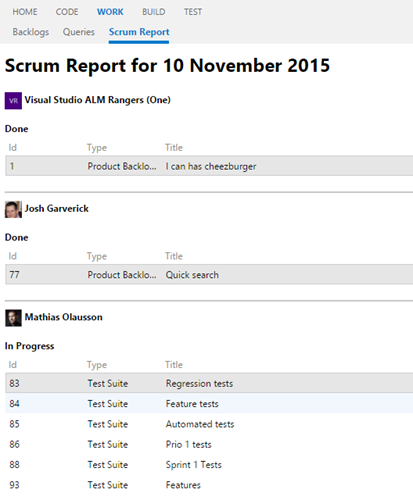

## View team members work state  ##

This extension provides scrum reports in your Visual Studio Online account, such as viewing the state of WIs that are New, Open, In Progress or Done for the current day. The report also groups them by team member and by state making it easier to read.
This extension is based on a query named "Scrum report" that is created by the extension.

## Query ##

You can change the "Scrum report" query to display changes of WIs daily to weekly to whatever suits your needs the best.

## Quick steps to get started ##

1. Connect to your team project.
1. Select **WORK**.
1. Select the tab **Scrum report**.
1. The report appears on the content page.
	- A grid appears for each team member and the state their task is in
	- Double click on a row to open the WI

## The Widget ##

Add the Widget on your dashboard and view the Scrum report summary.

The link "View Scrum report" open in the new windows the extension page.

By default the widget display 4 users, if there are more users you can increase the number of rows, changing the height of the widget.

